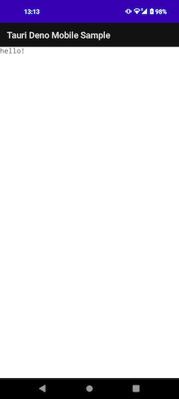

# Tauri Deno Mobile (Android) Sample
Building on MacOS
I only made this work with Android so far...

Heavy inspiration from [Tauri Deno Starter](https://github.com/marc2332/tauri-deno-starter)!



# Environment Setup

Assuming you have already installed latest `Deno` and `Rust`...

### Install rust-openssl and full xcode (Maybe optional?)

I had to install this to run `cargo mobile` and `cargo android`, which I mistakenly used first. So maybe `cargo tauri android` gets around this? I haven't uninstalled it, so not sure if it's actually necessary.

```sh
export PATH="/usr/local/opt/openssl@3/bin:$PATH"
```

Also, when I was running `cargo mobile`, it made me use the full xcode instead of xcode-select, because it was trying to build for iOS. So maybe that is required as well, not sure.

### Install Tauri Alpha Version (with Mobile)

Just followed cargo add stuff from the [tauri blog post](https://tauri.app/blog/2022/12/09/tauri-mobile-alpha/), ignoring the npm stuff.

### Android Stuff

Basically, I followed [the Alpha Docs](https://next--tauri.netlify.app/next/guides/getting-started/prerequisites/macos)

Downloaded Android Studio...

The download for NDK was in:
`Android Studio > Tools > SDK Manager > Android SDK > SDK TOOLS`

I installed:
- Android SDK Build-TOols
- NDK (Side by side)
- Android Emulator
- Android SDK Platform-Tools

Then found NDK version via `ls $HOME/Library/Android/sdk/ndk`

My env variables ended up looking like this:
```sh
export JAVA_HOME="/Applications/Android Studio.app/Contents/jre/Contents/Home"
export ANDROID_HOME="$HOME/Library/Android/sdk"
export NDK_HOME="$ANDROID_HOME/ndk/25.1.8937393"
```

# Project Setup

How we got the repo to this point...

- `cargo tauri init`
    - points to `../src/www`
    - beforeDevCommand: `deno run -A bundle.ts`
    - beforeBuildCommand: `deno run -A build.ts`
    - host: `http://localhost:3000`
- Added Deno Files
  - `bundle.ts`: for dev
  - `build.ts`: for build

# Usage

### Desktop
- `tauri run dev`
- `tauri run build`

### Android
- `tauri run android init`
- `tauri run android dev`
- `tauri run android build --debug` (need to sign app for release build to work)
